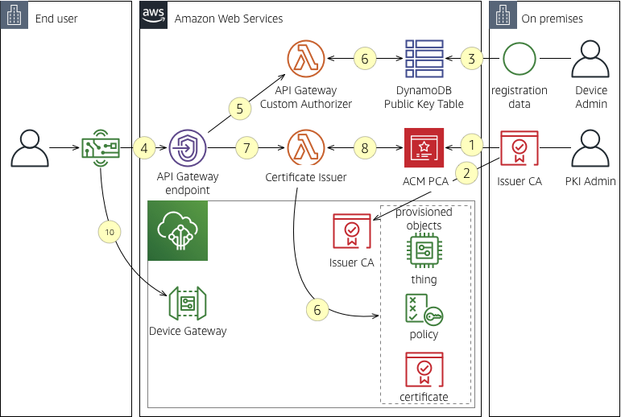
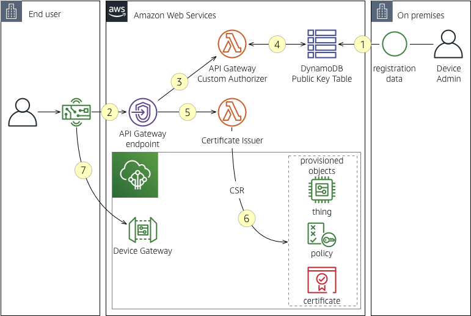

## IoT Provisioning Secret-free

This solution enables you to define a process to decouple
manufacturing from the provisioning process while assuring that
private secrets do not have the opportunity to be exposed at any point
throughout supply chain, manufacturing, and on-boarding.

This document is split into five sections.  It is suggested that the
sections be read and understood in order so you understand the
end-to-end system operation.

If you are impatient and want to try the mechanics immediately, please
go to the **Demonstration** section.

## Table of Contents

* [Overview](#overview)
* [System Design](#system-design)
  * [System Components](#system-components)
    * [IoT Device](#iot-device)
    * [API Gateway](#api-gateway)
  * [Deployment](#deployment)
  * [Staging](#staging)
  * [Processing](#processing)
* [System Implementation and Deployment](#system-implementation-and-deployment)
  * [Prerequisites](#prerequisites)
    * [Certificate Issuer](#certificate-issuer)
    * [Device](#device)
    * [CloudFormation](#cloudformation)
  * [AWS Lambda: Layer: pyOpenSSL](#aws-lambda:-layer:-pyopenssl)
  * [AWS Lambda: Lambda Authorizer for API
    Gateway](#aws-lambda:-lambda-authorizer-for-api-gateway)
  * [AWS Lambda: Issuing ACM based
   certificates](#aws-lambda:-issuing-acm-based-certificates)
  * [AWS Lambda: Issuing AWS IoT Core based
   certificates](#aws-lambda:-issuing-aws-iot-core-based-certificates)
  * [DynamoDB Global Table](#dynamodb-global-table)
  * [API Gateway Endpoint, Resource, Method, Model, and
    Response](#apit-gateway-endpoint,-resource,-method,-model,-and-response)
  * [Upload and Deployment](#upload-and-depliyment)
* [Demonstration](#demonstration)
  * [AWS Certificate Manager Provisioning](#aws-certificate-manager-provisioning)
    * [Root Certificate Authority](#root-certificate-authority)
    * [Intermediate Certificate Authority](#intermediate-certificate-authority)
    * [Device Issuer Certificate Authority](#device-issuer-certificate-authority)
  * [Verifying the ACM Setup](#verifying-the-acm-setup)
  * [Loading the Table with Test Data](#loading-the-table-with-test-data)
  * [Verifying the AWS API Gateway Processing](#verifying-the-aws-api-gateway-processing)
  * [Running with an Edge Device](#running-with-an-edge-device)

## License Summary

This sample code is made available under the MIT-0 license. See the LICENSE file.

# Overview

The processes for the device manufacturer span across three areas:
management system deployment, public credential imports, and
credential issuance.  The first area initializes the cloud side
infrastructure. The second area defines the process of, on the
manufacturing line, retrieving the public key derived by the
immutable root of trust (private key) on the CC32xx microprocessor,
and saving the public key to storage.  The third area relates to the
workflows for certificate provisioning to the microprocessor as well
as AWS IoT, and the subsequent provisioning of relating artifacts
such as the IoT Thing, Policy, Group, and so forth.

The general premise for this process is, at device initialization by
the consumer, the firmware constructs a Certificate Signing Request
(CSR) and sends the payload, along with the microprocessor serial
number, to a REST endpoint. The endpoint has an custom
authentication method implemented to verify the signature on the
CSR. Upon verification, the CSR is sent to a code block that is
responsible for orchestrating the certificate issuance and
registration with AWS IoT Core. The process that enables this
capability is, at manufacturing time, being able to derive the
public key from the microprocessor, stage on storage, and then later
import to the AWS Cloud.

This paper defines a Proof of Concept and does not in any way infer
that the mechanisms decribed herein have been hardened and are
production ready.  Further, in the demo section, this paper describes
the design and operation for IoT credential provisioning with respect
to the functionality present in the Texas Instruments CC32xx
microcontroller family.  While not the only mechanism applicable to
this microcontroller, this process presents you with the flexibility
and low logistical friction that benefits customers.

# System Design

The system design defines and puts into context the components that
fulfill roles in the certificate provisioning process in the AWS
Cloud.  The following diagram describes the system components and
their relationships.  Each component has a letter which labels the
component described in the following section **System
Components**. Each component has at least one relationship which at
least one number. The number serves as a label for an action, usually
directional, between two components.

Note that there is consideration for latent certificate retrieval in
the case where the response payload may not be retrieved sufficiently
by the client where instead of the certificate response there is a
pre-signed S3 URL response where the certificate can be retrieved with
the https client and retried in the case of poor network connectivity.

Note that there is consideration for provisioning parity to occur
between ACM PCA and AWS IoT Core provisioning where all provisioning
aspects occur at the time of certificate provisioning. The challenge
in this case is the latent replication of provisioned artifacts across
regions when the client acquires a regional endpoint that may not yet
have the required resources. Further, it may cause complication with
the global provisioning pattern.

## Issuing with ACM PCA

The execution architecture for issuing certificates using ACM PCA is
defined by the following diagram.




1. The PKI Admin would have received a CSR from ACM PCA and a *parent
   issuer* then issues the certificate.  The PKI Admin then submits
   the issued certificate to ACM PCA.
2. The PKI Admin must register the issued CA certificate to every
   region where there device may connect.
3. The "device admin" is an abstract role for anyone who has the
   accountability for retrieving the device-id/pubkey payload from the
   manufacturing site and importing those pairs to DynamoDB.
4. The device is powered on, and the device notices that there is no
   provisioned certificate to a slot on the secure serialized flash.
   This triggers the routine for constructing the CSR according the
   product's design. The CSR is POST to API Gateway as a custom header
   value device-csr to endpoint method `/new`.
5. API Gateway received the POST and identifies the method as being
   configured with an Authorizer.  The header value (the CSR) is
   passed to the authorizer for evaluation. The authorizer will read
   the CSR subject value for CN for the device ID.
6. The lambda function attempts to retrieve the public key for the
   device-id enscribed to the CN value. DynamoDB returns the value
   when the device-id exists.  Upon receiving the public key value,
   the lambda function compares that to the CSR signature's public key
   value.  When the public key compares favorably, the lambda function
   issues a 200 response.  Otherwise:  404 is issued when the
   relating pubkey to the device-id is not found, and an access denied
   (GET CODE) when the key does not compare favorably.
7. When the authorizer returns a 200, then the method invokes the
   lambda function responsible for issuing the certificate.  The very
   same CSR is passed along to the lambda function.
8. The AWS Lambda function passes the CSR to ACM PCA for a target CA.
   When all subject line and issuance duration requirements have been
   met, then ACM PCA issues the certificate. Certificate issuance
   may take several seconds, so the lambda function waits until
   issuance completes and retrieves the payload.  The lambda function
   returns the certificate payload under code 200, and returns empty
   string with code 500 otherwise.  The reason for 500 is that it is
   expected that ACM PCA would issue the certificate if all conditions
   are met.  API Gateway consumes the response and passes it along to
   the client; the client should interrogate that a 200 or otherwise
   has been received, and upon a 200 persist the payload to the
   appropriate nonvolatile memory resource.
9. The device recogizes that there is a client certificate available
   to use for authentication. The client attempts to connect to the
   AWS IoT Core endpoint for the first time.
   
   *Note*: there is room for customization in the payload response
   from API Gateway to also include the region-sensitive connectivity
   endpoint.   This value should be saved to NVM for future use.  When
   connecting to AWS IoT Core, the system 
10. In the case where the certificate is not registered as active with
    AWS IoT Core, the JITP or JITR process occurs.  The diagram
    expresses the JITP process for simplicity, but you might require
    JITR when registration has requirements beyond the JITP
    capabilities. 
11. Upon successful JITP or JITR interrogation, the object
    provisioning occurs so that all required and accessory objects are
    instantiated to enable IoT Core authorization as well as future
    indexing and jobs through Thing Group attribution.


## Issuing with AWS IoT Core

The execution architecture for issuing certificates using AWS IoT Core
is defined by the following diagram.  Note that issuing certificates
using this method precludes you using the global provisioning pattern
so it should not be considered for large scale provisioning where
global connectivity and resiliency is required.

Note that the authorization steps 1-5 remain the same as ACM PCA
issuance steps 1-6 (with the exception of PKI admin activities) so
they will not be restated here.



6. Upon receiving the CSR, the certificate issuer lambda creates the
   certificate with AWS IoT Core using the CSR.  Once done, the lambda
   creates the Thing based on the device-id value represented by the
   CN in the certificate subject.  The policy most often is consistent
   across all things in the particular product line. If already found,
   the certificate is paired with the found policy; otherwise, the
   lambda creates the policy according to the application's
   requirements and links.  Further invocation does not require a
   policy.
7. At this point, all components are created and the certificate has
   been activated, so further connectivity occurs normally.
## Deployment

In the deployment process, infrastructure is deployed and the
Certificate Authority, along with the Just in Time Provisioning
(JITP) configuration, is initialized and made operational.  There
is an alternate deployment configuration where the certificate
issuer is AWS IoT Core instead of ACM PCA.  In the former case, the
constraint is the certificate can not be deployed to regions
globally.

# System Implementation and Deployment

## Prerequisites

The majority of the installation is performed through
CloudFormation. However, **you must configure the certificate issuer
and device yourself**.  Meaning, you need to choose the issuer (ACM
PCA or AWS IoT Core) the implement the device firmware for your
target microcontroller.

### Certificate Issuer

The System Design section expressed that you may use ACM PCA or
AWS IoT for issuing certificates. For large scale production
systems, it is strongly recommended you use ACM PCA to enable
global provisioning.

ACM PCA setup and configuration is not done through CloudFormation
since the issuer certificate must be issued by a parent CA that is
outside ACM PCA operation. As such, the process can be varying in
nature.  The Demonstration section shows a "self-signed" issuer CA
chain configuration that can be used for testing purposes.

### Device

The device must have firmware implemented, or is using a peripheral, that:

1.  Can derive the public key from the device identity private key.
2.  Can issue a CSR signed by the device identity private key.

### CloudFormation

    AWSTemplateFormatVersion: 2010-09-09
    Transform: AWS::Serverless-2016-10-31
    Description: >-
      AWS CloudFormation template for secretfree provisioning
    Parameters:
      TemplateBucket:
        Default: elberger-secretfree-template
        Description: >-
          The S3 bucket into which the template, lambda functions, and Web
          content have been uploaded.
        Type: String
      SkuName:
        Default: widgiot
        Description: >-
          Usually the shortened product name, uniquely representing a
          product line. This is done to keep multiple product capabilities
          and certificate issuance separate from one another.
        Type: String
      AcmPcaCaArn:
        Default: put-your-arn-here
        Description: >-
          The CA Arn for ACM PCA CA.  Note that this value is not
          validated and is applied to the lambda function environment.
        Type: String

The CloudFormation result emits three values.  These values are
exported in case you wish to build upon them.  Specifically, an
importer to the DynamoDB table may later be developed, in which
case the target database would need to be known.

    Outputs:
      ProvisioningTableArn:
        Description: >-
          The ARN for the provisioning DynamoDB table.
        Value: !GetAtt ProvisioningTable.Arn
        Export:
          Name: !Sub "${AWS::StackName}-ProvisioningTableArn"
      ProvisioningTableStream:
        Description: >-
          The Stream ARN for the provisioning DynamoDB table.
        Value: !GetAtt ProvisioningTable.StreamArn
        Export:
          Name: !Sub "${AWS::StackName}-ProvisioningTableStream"
      ProvisioningTableName:
        Description: >-
          The simple name for the provisioning DynamoDB table.
        Value: !Ref ProvisioningTable
        Export:
          Name: !Sub "${AWS::StackName}-ProvisioningTableName"

The remaining CloudFormation sections are **Resources** where the
parent node is `Resources.`

    Resources:


<a id="orgaaaa270"></a>

## AWS Lambda: Layer: pyOpenSSL

In this framework, two Lambda functions are implemented that use
the pyOpenSSL library.  Today, it is most natural to package
libraries into Layers and then apply the Layer to the lambda
function.  The library also contains natively compiled code which
requires building either on EC2 or in a container.  We will be
building the layer in a container.

In this section, create the pyOpenSSL Lambda function layer.  The
current version is **TODO**.  You must have `docker` installed and
running to perform the following. If you cannot have docker, you
will need to perform this work manually on Amazon Linux with
`pyenv`.

    D=$(dirname $0)
    cd ${D}
    P=$(pwd)
    
    echo D: ${D}
    echo P: ${P}
    
    mkdir -p ${P}/../tarz
    mkdir -p /tmp/pyopenssl
    pushd /tmp/pyopenssl
    
    # get all the files for the module and dependencies
    
    docker run \
           -v "$PWD":/var/task lambci/lambda:build-python3.6 /bin/bash \
           -c "mkdir python && pip install pyOpenSSL==19.0.0 -t python/; exit"
    
    zip -r ${P}/../tarz/lambda-layer-pyopenssl.zip .
    popd
    rm -rf /tmp/pyopenssl

To install the layer, evaluate the following CloudFormation resource.

    pyOpensslLayer:
      Type: AWS::Lambda::LayerVersion
      Properties:
        CompatibleRuntimes:
          - 'python3.6'
          - 'python3.7'
        Content:
          S3Bucket: !Ref TemplateBucket
          S3Key: 'lambda-layer-pyopenssl.zip'
        Description: "OpenSSL library"
        LayerName: "PyOpenSSL"
        LicenseInfo: "MIT"


<a id="org6e7346b"></a>

## AWS Lambda: Lambda Authorizer for API Gateway

In this section, we deploy the Lambda Authorizer Lambda Function.
The bulk of the authorizer code was taken from the [python blueprint
on Github](https://github.com/awslabs/aws-apigateway-lambda-authorizer-blueprints/blob/master/blueprints/python/api-gateway-authorizer-python.py). The Custom Authorizer interrogates the header value
that includes the Device ID and the Signature.

    import json
    import base64
    import boto3
    import re
    import time
    import pprint
    import os
    import OpenSSL.crypto
    from OpenSSL.crypto import load_certificate_request, FILETYPE_PEM, dump_publickey
    
    def get_pubkey( req ):
        device_id = req.get_subject().CN
    
        d = boto3.client('dynamodb')
        s3 = boto3.resource('s3')
        
        response = d.get_item(
            Key={ 'device-id': { 'S' : device_id } },
            TableName=os.environ['SECRETFREE_TABLENAME']
        )
    
        return response['Item']['pubkey']['S']
    
    def lambda_handler(event, context):
        print("Method ARN: " + event['methodArn'])
        principalId = "user|a1b2c3d4"
        
        # Get the public key from the CSR
        device_csr = base64.b64decode(event['headers']['device-csr'])
        req = load_certificate_request( FILETYPE_PEM, device_csr )
        req_pubkey = req.get_pubkey()
        req_pubkey_pem = dump_publickey( FILETYPE_PEM, req_pubkey )
    
        # Get the public key from Dynamo. Load and then dump to format proper
        ori_pubkey_pem = get_pubkey(req)
        pubbuf = OpenSSL.crypto.load_publickey(FILETYPE_PEM, ori_pubkey_pem)
        ori_pubkey_pem = dump_publickey( FILETYPE_PEM, pubbuf)
        
        print(ori_pubkey_pem)
        print(req_pubkey_pem)
        
        if ( ori_pubkey_pem == req_pubkey_pem ):
            # Return 201 and respond w sigv4 uri to signed certificate
            tmp = event['methodArn'].split(':')
            apiGatewayArnTmp = tmp[5].split('/')
            awsAccountId = tmp[4]
        
            policy = AuthPolicy(principalId, awsAccountId)
            policy.restApiId = apiGatewayArnTmp[0]
            policy.region = tmp[3]
            policy.stage = apiGatewayArnTmp[1]
            policy.denyAllMethods()
            policy.allowMethod(HttpVerb.POST, "/new/*")
        
            # Finally, build the policy
            authResponse = policy.build()
    
            return authResponse
        else:
            raise Exception('Unauthorized')
        
    class HttpVerb:
        GET     = "GET"
        POST    = "POST"
        PUT     = "PUT"
        PATCH   = "PATCH"
        HEAD    = "HEAD"
        DELETE  = "DELETE"
        OPTIONS = "OPTIONS"
        ALL     = "*"
    
    class AuthPolicy(object):
        awsAccountId = ""
        """The AWS account id the policy will be generated for. This is used to create the method ARNs."""
        principalId = ""
        """The principal used for the policy, this should be a unique identifier for the end user."""
        version = "2012-10-17"
        """The policy version used for the evaluation. This should always be '2012-10-17'"""
        pathRegex = "^[/.a-zA-Z0-9-\*]+$"
        """The regular expression used to validate resource paths for the policy"""
    
        """these are the internal lists of allowed and denied methods. These are lists
        of objects and each object has 2 properties: A resource ARN and a nullable
        conditions statement.
        the build method processes these lists and generates the approriate
        statements for the final policy"""
        allowMethods = []
        denyMethods = []
    
        restApiId = "*"
        """The API Gateway API id. By default this is set to '*'"""
        region = "*"
        """The region where the API is deployed. By default this is set to '*'"""
        stage = "*"
        """The name of the stage used in the policy. By default this is set to '*'"""
    
        def __init__(self, principal, awsAccountId):
            self.awsAccountId = awsAccountId
            self.principalId = principal
            self.allowMethods = []
            self.denyMethods = []
    
        def _addMethod(self, effect, verb, resource, conditions):
            """Adds a method to the internal lists of allowed or denied methods. Each object in
            the internal list contains a resource ARN and a condition statement. The condition
            statement can be null."""
            if verb != "*" and not hasattr(HttpVerb, verb):
                raise NameError("Invalid HTTP verb " + verb + ". Allowed verbs in HttpVerb class")
            resourcePattern = re.compile(self.pathRegex)
            if not resourcePattern.match(resource):
                raise NameError("Invalid resource path: " + resource + ". Path should match " + self.pathRegex)
    
            if resource[:1] == "/":
                resource = resource[1:]
    
            resourceArn = ("arn:aws:execute-api:" +
                self.region + ":" +
                self.awsAccountId + ":" +
                self.restApiId + "/" +
                self.stage + "/" +
                verb + "/" +
                resource)
    
            if effect.lower() == "allow":
                self.allowMethods.append({
                    'resourceArn' : resourceArn,
                    'conditions' : conditions
                })
            elif effect.lower() == "deny":
                self.denyMethods.append({
                    'resourceArn' : resourceArn,
                    'conditions' : conditions
                })
    
        def _getEmptyStatement(self, effect):
            """Returns an empty statement object prepopulated with the correct action and the
            desired effect."""
            statement = {
                'Action': 'execute-api:Invoke',
                'Effect': effect[:1].upper() + effect[1:].lower(),
                'Resource': []
            }
    
            return statement
    
        def _getStatementForEffect(self, effect, methods):
            """This function loops over an array of objects containing a resourceArn and
            conditions statement and generates the array of statements for the policy."""
            statements = []
    
            if len(methods) > 0:
                statement = self._getEmptyStatement(effect)
    
                for curMethod in methods:
                    if curMethod['conditions'] is None or len(curMethod['conditions']) == 0:
                        statement['Resource'].append(curMethod['resourceArn'])
                    else:
                        conditionalStatement = self._getEmptyStatement(effect)
                        conditionalStatement['Resource'].append(curMethod['resourceArn'])
                        conditionalStatement['Condition'] = curMethod['conditions']
                        statements.append(conditionalStatement)
    
                statements.append(statement)
    
            return statements
    
        def allowAllMethods(self):
            """Adds a '*' allow to the policy to authorize access to all methods of an API"""
            self._addMethod("Allow", HttpVerb.ALL, "*", [])
    
        def denyAllMethods(self):
            """Adds a '*' allow to the policy to deny access to all methods of an API"""
            self._addMethod("Deny", HttpVerb.ALL, "*", [])
    
        def allowMethod(self, verb, resource):
            """Adds an API Gateway method (Http verb + Resource path) to the list of allowed
            methods for the policy"""
            self._addMethod("Allow", verb, resource, [])
    
        def denyMethod(self, verb, resource):
            """Adds an API Gateway method (Http verb + Resource path) to the list of denied
            methods for the policy"""
            self._addMethod("Deny", verb, resource, [])
    
        def allowMethodWithConditions(self, verb, resource, conditions):
            """Adds an API Gateway method (Http verb + Resource path) to the list of allowed
            methods and includes a condition for the policy statement. More on AWS policy
            conditions here: http://docs.aws.amazon.com/IAM/latest/UserGuide/reference_policies_elements.html#Condition"""
            self._addMethod("Allow", verb, resource, conditions)
    
        def denyMethodWithConditions(self, verb, resource, conditions):
            """Adds an API Gateway method (Http verb + Resource path) to the list of denied
            methods and includes a condition for the policy statement. More on AWS policy
            conditions here: http://docs.aws.amazon.com/IAM/latest/UserGuide/reference_policies_elements.html#Condition"""
            self._addMethod("Deny", verb, resource, conditions)
    
        def build(self):
            """Generates the policy document based on the internal lists of allowed and denied
            conditions. This will generate a policy with two main statements for the effect:
            one statement for Allow and one statement for Deny.
            Methods that includes conditions will have their own statement in the policy."""
            if ((self.allowMethods is None or len(self.allowMethods) == 0) and
                (self.denyMethods is None or len(self.denyMethods) == 0)):
                raise NameError("No statements defined for the policy")
    
            policy = {
                'principalId' : self.principalId,
                'policyDocument' : {
                    'Version' : self.version,
                    'Statement' : []
                }
            }
    
            policy['policyDocument']['Statement'].extend(self._getStatementForEffect("Allow", self.allowMethods))
            policy['policyDocument']['Statement'].extend(self._getStatementForEffect("Deny", self.denyMethods))
    
            return policy

The code must be zipped up in preparation for submitting the
payload as part of the Lambda function deployment.

    P=$(pwd)/$(dirname $0)
    mkdir -p ../tarz
    cd ../lambda-authorizer
    zip -r ../tarz/lambda-authorizer.zip .

The code deployment requires the pointer to the DynamoDB Table
since the public key must be fetched.  When installing the Lambda
function, three resources must be implemented:

-   Invoke permission: what can invoke this lambda function
-   Role: what this lambda function can do outside its immediate
    scope
-   Payload: the lambda function definition itself

We will start with the payload.

    PerSkuLambdaAuthorizer:
      Type: AWS::Lambda::Function
      Properties:
        FunctionName: !Sub ${SkuName}-secretfree-authorizer
        Code:
          S3Bucket: !Ref TemplateBucket
          S3Key:    lambda-authorizer.zip
        Role: !GetAtt PerSkuLambdaAuthorizerExecutionRole.Arn
        Handler: main.lambda_handler
        Runtime: python3.6
        MemorySize: 1024
        Layers:
          - !Ref pyOpensslLayer
        Environment:
          Variables:
            SECRETFREE_TABLENAME: !Ref SkuName
    
    PerSkuLambdaAuthorizerInvokePermission:
      Type: AWS::Lambda::Permission
      Properties:
        FunctionName: !GetAtt PerSkuLambdaAuthorizer.Arn
        Action: lambda:InvokeFunction
        Principal: apigateway.amazonaws.com
        SourceAccount: !Ref AWS::AccountId
        SourceArn: !Sub arn:aws:execute-api:${AWS::Region}:${AWS::AccountId}:${ProvisioningRestApi}/*/POST/new
    
    PerSkuLambdaAuthorizerExecutionRole:
      Type: AWS::IAM::Role
      Properties:
        Path: /
        RoleName: !Sub ${SkuName}-secretfree-authorizer-role
        ManagedPolicyArns:
          - arn:aws:iam::aws:policy/AmazonS3ReadOnlyAccess
          - arn:aws:iam::aws:policy/AWSIoTFullAccess
        AssumeRolePolicyDocument:
          Statement:
            -
              Effect: Allow
              Principal:
                Service: lambda.amazonaws.com
              Action:
                - sts:AssumeRole
        Policies:
          -
            PolicyName: !Sub ${SkuName}-secretfree-authorizer-logger
            PolicyDocument:
              Version: 2012-10-17
              Statement:
                -
                  Effect: Allow
                  Action: logs:CreateLogGroup
                  Resource: !Sub arn:aws:logs:${AWS::Region}:${AWS::AccountId}:*
                -
                  Effect: Allow
                  Action:
                    - logs:CreateLogStream
                    - logs:PutLogEvents
                  Resource: !Sub arn:aws:logs:${AWS::Region}:${AWS::AccountId}:log-group:/aws/lambda/${SkuName}-${AWS::StackName}:*


<a id="orgb7177d3"></a>

## AWS Lambda: ACM based certificate issuance

The code for certificate issuance by ACM is at
[lambda-issuer-acmpca/main.py](lambda-issuer-acmpca/main.py).

The following diagram describes the execution flow for ACM PCA
issuance, followed by an explanation of main steps. Note that this
flow occurs after the [Lambda
Authorizer](aws-lambda:-lambda-authorizer-for-api-gateway) completes
successfully.

TODO: DIAGRAM

TODO: EXECUTION FLOW STEPS

The code must be zipped up in preparation for submitting the
payload as part of the Lambda function deployment.  This script is at
[script/package-lambda-issuer-acmpca.sh](script/package-lambda-issuer-acmpca.sh).

## AWS Lambda: AWS IoT Core based certificate issuance

    import json
    import boto3
    import time
    import base64
    import os
    import OpenSSL.crypto
    from OpenSSL.crypto import load_certificate_request, FILETYPE_PEM, dump_publickey
    
    def get_pubkey( req ):
        device_id = req.get_subject().CN
    
        d = boto3.client('dynamodb')
        s3 = boto3.resource('s3')
        
        response = d.get_item(
            Key={ 'device-id': { 'S' : device_id } },
            TableName='widgiot-public-keys'
        )
    
        s3_bucket = response['Item']['pubkey-bucket']['S']
        s3_object = response['Item']['pubkey-object']['S']
        content_object = s3.Object(s3_bucket, s3_object)
        file_content = content_object.get()['Body'].read().decode('utf-8')
    
        return file_content
    
    def provision_certificate( csr, pubkey ):
        acmpca = boto3.client('acm-pca')
        ca_arn = os.environ['ACMPCA_CA_ARN']
            
        # Create the Certificate
        # TODO: Automatically compute days remaining ... somehow?
        cert = acmpca.issue_certificate(
            CertificateAuthorityArn=ca_arn,
            SigningAlgorithm='SHA256WITHRSA',
            Csr=csr,
            Validity={
                'Value': 150,
                'Type': 'DAYS'
            },
            IdempotencyToken='1234'
        )
        
        # Fetch the certificate
        err = 1
        while 1:
            try:
                certificate = acmpca.get_certificate(
                    CertificateAuthorityArn=ca_arn,
                    CertificateArn=cert['CertificateArn']
                )
                return certificate
            except:
                print("Certificate not ready yet")
                time.sleep(1)
    
    
    def lambda_handler(event, context):
        print(event)
        print(context)
        csr = base64.b64decode(event['headers']['device-csr'])
        req = load_certificate_request( FILETYPE_PEM, csr )
    
        pubkey = get_pubkey(req)
        response = provision_certificate(csr, pubkey)
    
        return response['Certificate']

    P=$(dirname $0)
    mkdir -p ${P}/../tarz
    cd ../lambda-issuer-iotcore
    if test $? != 0; then echo ERROR; exit 1; fi
    zip -r ../tarz/lambda-issuer-iotcore.zip .

    PerSkuLambdaProvisioningACMPCAIotCore:
      Type: AWS::Lambda::Function
      Properties:
        FunctionName: !Sub ${SkuName}-secretfree-iotcore
        Code:
          S3Bucket: !Ref TemplateBucket
          S3Key:    lambda-issuer-iotcore.zip
        Role: !GetAtt PerSkuLambdaAuthorizerExecutionRole.Arn
        Handler: main.lambda_handler
        Runtime: python3.6
        MemorySize: 1024
        Layers:
          - !Ref pyOpensslLayer
        Environment:
          Variables:
            ACMPCA_CA_ARN: !Ref AcmPcaCaArn
            SECRETFREE_TABLENAME: !Ref ProvisioningTable


<a id="org3572e39"></a>

## DynamoDB Global Table

The DynamoDB Global Table is created to hold pointers to the public
keys that are used for signature verification.  The reason for the
global table is the request could come in from any API GW endpoint
from any of the deployed regions based on the Route 53 routing.

Create one table but prepare it for global table promotion by
enabling streaming.

The table is setup with two attributes: `device-id` and `pubkey`.  The
payload derived from the manufacturing line is imported to this table.

For the CloudFormation definition, see the **ProvisioningTable**
resource in the deployment [cfn](cfn/secretfree.yml).

## API Gateway Endpoint, Resource, Method, Model, and Response

API Gateway is used to manage the plumbing for the device POST to
the cloud composed of a basic header parameter of a CSR payload.

Once created, then we will create the resource upon which IoT
devices will call with POST and the CSR payload.

    ProvisioningRestApi:
      Type: AWS::ApiGateway::RestApi
      Properties:
        Name: !Sub "${SkuName}-IoTProvisioning"
        Description: >-
          !Sub "This API enables certificate provisioning for the ${SkuName} product line."
        ApiKeySourceType: HEADER
        EndpointConfiguration:
          Types:
            - REGIONAL

Next, we create the Custom Authorizer for the API in API Gateway.

    
    ProvisioningResourceAuthorizer:
      Type: AWS::ApiGateway::Resource
      Properties:
        RestApiId: !Ref ProvisioningRestApi
        ParentId: !GetAtt ProvisioningRestApi.RootResourceId
        PathPart: authorizer

Next, we configure the New resource to use the Custom
Authorizer. The following defines the REST API endpoint for the
Lambda Authorizer.

    
    ProvisioningResourceNew:
      Type: AWS::ApiGateway::Resource
      Properties:
        RestApiId: !Ref ProvisioningRestApi
        ParentId:  !GetAtt ProvisioningRestApi.RootResourceId
        PathPart: new

Create the Lambda function that the POST method will invoke.  You
will need to perform the following steps, which includes zipping
the Lambda function to include dependent libraries.

[write steps/cli here]

1.  On the command line, change directory to ~/ti-provisioning/widgiot-post.
2.  Create file named widgiot-post.py.
3.  Enter the following into widgiot-post.py.

Next, we must create models for the Request and Response.  For the
Request, we define Device ID, Signature, and CSR.  For Response, we
define Certificate.  The models are named NewCertificateInputModel
and NewCertificateOutputModel respectively.

Create the Response Model.

The output model is required to tailor the output as block text.
This output model is *deprecated* and will be removed in a later
release since the `RESPONSE` is a text/plain certificate block.

    
    ProvisioningMethodOutputModel:
      Type: AWS::ApiGateway::Model
      Properties:
        RestApiId: !Ref ProvisioningRestApi
        Name: NewCertificateOutputModel
        Description: >-
          This model describes the output payload for requesting a new certificate
        ContentType: application/json
        Schema: >-
          {
          "$schema": "http://json-schema.org/draft-04/schema#",
          "title": "NewCertificateOutputModel",
          "type": "object",
          "properties": {
            "Certificate": { "type": "string" },
            "CertificateChain": { "type": "string" }
           }}

Next, we create the POST method for the New (/new) resource to
invoke the Lambda function that is responsible for the certificate
provisioning actions with ACM PCA.

    ProvisioningMethodNewPost:
      Type: AWS::ApiGateway::Method
      Properties:
        RestApiId: !Ref ProvisioningRestApi
        ResourceId: !Ref ProvisioningResourceNew
        ApiKeyRequired: False
        AuthorizationType: CUSTOM
        AuthorizerId: !Ref ProvisioningAuthorizer
        HttpMethod: POST
        RequestParameters: { "method.request.header.device-csr": true }
        Integration:
          Type: AWS
          IntegrationHttpMethod: POST
          Uri: !Join
            - ':'
            - - arn
              - aws
              - apigateway
              - !Ref AWS::Region
              - lambda
              - path/2015-03-31/functions/arn
              - aws
              - lambda
              - !Ref AWS::Region
              - !Ref AWS::AccountId
              - function
              - !Sub ${SkuName}-provisioning-acmpca-${AWS::StackName}/invocations
          RequestTemplates:
            application/json: >-
              {
              "method" : "$context.httpMethod",
              "body"   : $input.json('$'),
              "headers": {
                #foreach($param in $input.params().header.keySet())
                "$param" : "$util.escapeJavaScript($input.params().header.get($param))"
                    #if($foreach.hasNext),#end
                #end
              }
              }
          RequestParameters: { "integration.request.header.device-csr": "method.request.header.device-csr" }
          PassthroughBehavior: WHEN_NO_TEMPLATES
          ContentHandling: CONVERT_TO_TEXT
          TimeoutInMillis: 29000
          IntegrationResponses:
            - StatusCode: 200
              ResponseTemplates: { "application/json" : "$input.json('$.body')" }
        MethodResponses:
          - StatusCode: 200
            ResponseModels: { "application/json" : "NewCertificateOutputModel" }
    
    ProvisioningAuthorizer:
      Type: AWS::ApiGateway::Authorizer
      Properties:
        AuthorizerResultTtlInSeconds: 0
        AuthorizerUri: !Join
          - ':' 
          - - arn
            - aws
            - apigateway
            - !Ref AWS::Region
            - lambda
            - path/2015-03-31/functions/arn
            - aws
            - lambda
            - !Ref AWS::Region
            - !Ref AWS::AccountId
            - function
            - !Sub ${SkuName}-authorizer-${AWS::StackName}/invocations
        Type: REQUEST
        IdentitySource: method.request.header.device-csr
        Name: CsrAuthorizer
        RestApiId: !Ref ProvisioningRestApi

Next, we deploy the API. Deploying the API makes the endpoint “live”
for external clients.  The deployment Stage is named `Test`.  This
document may be amended later to include a CloudWatch logging
group.

    ProvisioningDeploymentTest:
      Type: AWS::ApiGateway::Deployment

The deployment must wait for the method to be constucted or else an
error results; please consult the CloudFormation developer guide for
more information.

    DependsOn: ProvisioningResourceNew
    Properties:

We use the StageName `Test` as a placeholder to verify straight
through client testing.  In your deployment, this should align with
the way you have defined your pipeline.

    StageName: Test
    RestApiId: !Ref ProvisioningRestApi

## Upload and Deployment

Several scripts have been added to aid in the deployment process.
The template and lambda function payloads must be staged to Amazon
S3. After staging, you can invoke CloudFormation using the uploaded
template.

First, invoke the `build-and-upload.sh` script.  This script invokes
the scripts to build the layer and lambda function packages
described in the previous section.  It also ensures you have an S3
bucket created.

The script has relatively sane defaults.  If you are running in
EC2, you will likely need to override these values.

-   `PREFIX`: the same value as `$USER` in your command line
    environment.  If you find that the S3 bucket name is not usique,
    you will need to override this value.
-   `REGION`: the same value configured for your default AWS
    credential.

If you are configuring for use with AWS IoT Core (recommended for
prototyping or evaluation), and running from your local system, you
would invoke the following:

    ./build-and-upload.sh

If you are configuring this with ACM PCA (strongly recommended for
multi-region production environments).  First you need to get the
Arn.  The best way to search for that might me the CA's
CommonName.  For example, when having the Common Name
`us-east-1.widgiot.automatra.net`, we could find it by:

    COMMON_NAME=${1:=us-east-1.widgiot.automatra.net}
    CertificateAuthorityArn=$(aws acm-pca list-certificate-authorities \
                                  --query "CertificateAuthorities[?CertificateAuthorityConfiguration.Subject.CommonName=='${COMMON_NAME}'].Arn" \
                                  --output text)

This script is named get-pcmcia-ca-arn.sh in scripts/ for your convenience.

The first argument, which is
the ACM PCA CA Arn, must be applied to the command line, for example:

```bash
./build-and-upload.sh ${CertificateAuthorityArn}
```

And if you want to override the SKUNAME and possibly the target
REGION, the command line would be configured like:

```bash
SKUNAME=superUniquePrefix REGION=us-west-2 ./build-and-upload.sh ${CertificateAuthorityArn}
```

# Demonstration

The automation for deploying the code installs both ACM PCA and AWS
IoT based issuance Lambdas. The API Gateway endpoint you invoke
determines the issuer.  If you will be using AWS IoT as the issuer,
skip to the [Test Data Load](#test-data-load) section.

## AWS Certificate Manager Provisioning

**NOTE** only follow this section if you want to provision certificates
with ACM PCA.

With AWS IoT Provisioning, in order to use the provisioning
template, the invocation will need to be made by AWS Lambda. No PKI
work is required for this section since the process uses AWS IoT to
issue the certificate on our behalf, and JITP is not availabile for
AWS IoT issued certificates.

In this section, we install and configure AWS Certificate Manager
for Private Certificate Authority.

At the time of writing, AWS Certificate Manager for Private
Certificate Authority allows configuring a Subuordinate CA only.
This means we need to define the certificate hierarchy while
keeping in mind multi-region.  There are several choices based on
blast radius confinement techniques. In the case of this
demonstration, we will create a Root CA, an Intermediate CA
representing a product line. Subordinate CAs are then imported on a
per-region to facilitate per-region registration; later, each CA is
to be individually registered with AWS IoT.

We first need to create the certificate hierarchy (roughly taken
from Bulletproof SSL and TLS - for more information, check that
book).

### Root Certificate Authority

When creating a root certificate, this means it's the root certificate
for your organziation. Usually, you will want a verifiable issuer
such as Amazon, Thawte, etcetera.  Since we would not want to do this
for prototyping, the root authority will be self-signed.  **Do not do
this for production workloads. You should have a verifiable root CA
issuer give you an intermediate that represents your entity.**

#### Root Certificate Short Story

To initialize the root authority, use the `demo/script/root-ca.sh`
script. The script does not require any parameters if you want to use
the demo defaults (see [Long Story](#root-certificate-long-story)).

Jump to the [Intermediate Certificate
Authority](intermediate-certificate-authority) section when completed.

#### Root Certificate Long Story

Create the base directory.  You can create the root directory name
whatever you like, but let's pretend you work for a company named
`widgies` with product name `widgiot`.  Note that we are working in a
UNIX-like environment so if you're running Windows, instantiate a
small EC2 instance to do your work.

```bash
cd ~ && mkdir -p provisioning/root-ca
cd provisioning/root-ca
mkdir certs db private
chmod 700 private
touch db/index
openssl rand -hex 16 > db/serial
echo 1001 > db/crlnumber
```

Create the root-ca.conf file.  There is a challenge here that you need
to be aware.  When you are issuing CSRs for clients, the policy at the
CA level must meet the demands at the CSR level. For example, if you
want to put Locality (L) in the Subject, it must be defined in this
OpenSSL configuration as at least optional.  Accordingly, while we may
not issue the CA with locality, the client certificate *may* always
issue with locality.

This is an example Root CA using a domain that the author owns.  You
will need to modify this template with your target domain.

    [default]
    name                    = root-ca
    domain_suffix           = automatra.net
    aia_url                 = http://$name.$domain_suffix/$name.crt
    crl_url                 = http://$name.$domain_suffix/$name.crl
    ocsp_url                = http://ocsp.$name.$domain_suffix:9080
    default_ca              = ca_default
    name_opt                = utf8,esc_ctrl,multiline,lname,align
    
    [ca_dn]
    countryName             = "US"
    organizationName        = "Automatra"
    commonName              = "Root CA"
    
    [ca_default]
    home                    = .
    database                = $home/db/index
    serial                  = $home/db/serial
    crlnumber               = $home/db/crlnumber
    certificate             = $home/\$name.crt
    private_key             = $home/private/$name.key
    RANDFILE                = $home/private/random
    new_certs_dir           = $home/certs
    unique_subject          = no
    copy_extensions         = none
    default_days            = 3650
    default_crl_days        = 365
    default_md              = sha256
    policy                  = policy_c_o_match
    
    [policy_c_o_match]
    countryName             = match
    stateOrProvinceName     = optional
    organizationName        = match
    organizationalUnitName  = optional
    commonName              = supplied
    localityName            = optional
    emailAddress            = optional
    
    [req]
    default_bits            = 4096
    encrypt_key             = yes
    default_md              = sha256
    utf8                    = yes
    string_mask             = utf8only
    prompt                  = no
    distinguished_name      = ca_dn
    req_extensions          = ca_ext
    
    [ca_ext]
    basicConstraints        = critical,CA:true
    keyUsage                = critical,keyCertSign,cRLSign
    subjectKeyIdentifier    = hash
    [sub_ca_ext]
    authorityInfoAccess     = @issuer_info
    authorityKeyIdentifier  = keyid:always
    basicConstraints        = critical,CA:true,pathlen:0
    crlDistributionPoints   = @crl_info
    extendedKeyUsage        = clientAuth,serverAuth
    keyUsage                = critical,keyCertSign,cRLSign
    nameConstraints         = @name_constraints
    subjectKeyIdentifier    = hash
    
    [crl_info]
    URI.0                   = $crl_url
    [issuer_info]
    caIssuers;URI.0         = $aia_url
    OCSP;URI.0              = $ocsp_url
    
    [name_constraints]
    permitted;DNS.0=example.com
    permitted;DNS.1=example.org
    excluded;IP.0=0.0.0.0/0.0.0.0
    excluded;IP.1=0:0:0:0:0:0:0:0/0:0:0:0:0:0:0:0
    [ocsp_ext]
    authorityKeyIdentifier  = keyid:always
    basicConstraints        = critical,CA:false
    extendedKeyUsage        = OCSPSigning
    keyUsage                = critical,digitalSignature
    subjectKeyIdentifier    = hash

##### Root CA: quick


##### Root CA: details

Create the private key for the Root CA.

```bash
openssl req -new                         \
            -config  root-ca.conf        \
            -out     root-ca.csr         \
            -keyout  private/root-ca.key \
            -passout pass:nopass
```

Create the self-signed certificate.  Note the **selfsign** flag.  In
production, you will NOT do this.

```bash
openssl ca -selfsign            \
           -config root-ca.conf \
           -in root-ca.csr      \
           -out root-ca.crt     \
           -extensions ca_ext   \
           -batch               \
           -passin pass:nopass
```

Create the private key and CSR for OCSP.

```bash
openssl req -new                                                \
            -newkey   rsa:2048                                  \
            -subj    "/C=US/O=Automatra/CN=OCSP Root Responder" \
            -keyout  private/root-ocsp.key                      \
            -out     root-ocsp.csr                              \
            -batch                                              \
            -passout pass:nopass
```

Issue the OCSP certificate.

```bash
openssl ca -config     root-ca.conf  \
           -in         root-ocsp.csr \
           -out        root-ocsp.crt \
           -extensions ocsp_ext      \
           -days       30            \
           -batch                    \
           -passin     pass:nopass
```

The Root CA and OCSP certificate has been issued.

### Intermediate Certificate Authority

Create structure for the WidgIoT Intermediate Certificate.
WidgIoT is the example name we are giving for demonstration
purposes.

First, initialize the database for the Intermediate CA.

```bash
cd ~ && mkdir -p provisioning/intermediate-ca
cd provisioning/intermediate-ca
mkdir certs db private
chmod 700 private
touch db/index
openssl rand -hex 16 > db/serial
echo 1001 > db/crlnumber
```

Create the configuration file for the Intermediate CA representing
the WidgIoT product line.  The meaning of this entire configuration is
beyond the scope of this README and should be analyzed in the
aforementioned book.

    [default]
    name                    = widgiot-ca
    domain_suffix           = automatra.net
    aia_url                 = http://$name.$domain_suffix/$name.crt
    crl_url                 = http://$name.$domain_suffix/$name.crl
    ocsp_url                = http://ocsp.$name.$domain_suffix:9081
    default_ca              = ca_default
    name_opt                = utf8,esc_ctrl,multiline,lname,align
    
    [ca_dn]
    countryName             = "US"
    organizationName        = "Automatra"
    commonName              = "WidgIoT"
    
    [ca_default]
    home                    = .
    database                = $home/db/index
    serial                  = $home/db/serial
    crlnumber               = $home/db/crlnumber
    certificate             = $home/$name.crt
    private_key             = $home/private/$name.key
    RANDFILE                = $home/private/random
    new_certs_dir           = $home/certs
    unique_subject          = no
    default_days            = 365
    default_crl_days        = 30
    copy_extensions         = copy
    default_md              = sha256
    policy                  = policy_c_o_match
    
    [policy_c_o_match]
    countryName             = match
    stateOrProvinceName     = optional
    organizationName        = match
    organizationalUnitName  = optional
    commonName              = supplied
    localityName            = optional
    emailAddress            = optional
    
    [req]
    default_bits            = 4096
    encrypt_key             = yes
    default_md              = sha256
    utf8                    = yes
    string_mask             = utf8only
    prompt                  = no
    distinguished_name      = ca_dn
    req_extensions          = ca_ext
    
    [ca_ext]
    basicConstraints        = critical,CA:true
    keyUsage                = critical,keyCertSign,cRLSign
    subjectKeyIdentifier    = hash

    [sub_ca_ext]
    authorityInfoAccess     = @issuer_info
    authorityKeyIdentifier  = keyid:always
    basicConstraints        = critical,CA:true,pathlen:0
    crlDistributionPoints   = @crl_info
    extendedKeyUsage        = clientAuth,serverAuth
    keyUsage                = critical,keyCertSign,cRLSign
    nameConstraints         = @name_constraints
    subjectKeyIdentifier    = hash
    
    [crl_info]
    URI.0                   = $crl_url
    [issuer_info]
    caIssuers;URI.0         = $aia_url
    OCSP;URI.0              = $ocsp_url
    
    [name_constraints]
    permitted;DNS.0=example.com
    permitted;DNS.1=example.org
    excluded;IP.0=0.0.0.0/0.0.0.0
    excluded;IP.1=0:0:0:0:0:0:0:0/0:0:0:0:0:0:0:0
    [ocsp_ext]
    authorityKeyIdentifier  = keyid:always
    basicConstraints        = critical,CA:false
    extendedKeyUsage        = OCSPSigning
    keyUsage                = critical,digitalSignature
    subjectKeyIdentifier    = hash
    
    [server_ext]
    authorityInfoAccess     = @issuer_info
    authorityKeyIdentifier  = keyid:always
    basicConstraints        = critical,CA:false
    crlDistributionPoints   = @crl_info
    extendedKeyUsage        = clientAuth,serverAuth
    keyUsage                = critical,digitalSignature,keyEncipherment
    subjectKeyIdentifier    = hash
    
    [client_ext]
    authorityInfoAccess     = @issuer_info
    authorityKeyIdentifier  = keyid:always
    basicConstraints        = critical,CA:false
    crlDistributionPoints   = @crl_info
    extendedKeyUsage        = clientAuth
    keyUsage                = critical,digitalSignature
    subjectKeyIdentifier    = hash

Create the private key and generate the CSR for the WidgIoT
product line.

```bash
openssl req -new                           \
            -config widgiot-ca.conf        \
            -out widgiot-ca.csr            \
            -keyout private/widgiot-ca.key \
            -batch                         \
            -passout pass:nopass
```

Have the root CA issue the intermediate CA.

```bash
cd ../root-ca/
openssl ca -config root-ca.conf \
           -in ../widgiot-ca/widgiot-ca.csr \
           -out widgiot-ca.crt \
           -extensions sub_ca_ext \
           -batch \
           -passin pass:nopass
cp widgiot-ca.crt ../widgiot-ca
cp root-ca.crt ../widgiot-ca #for ease of operation when issuing aws cert
```

### Device Issuer Certificate Authority

Create and change to directory for managing the ACM PCA issued
certificates.

```bash
cd ~ && mkdir -p provisioning/widgiot-ca
cd provisioning/widgiot-ca
```

Create an S3 bucket policy for the CRL lists that will be used by the
cloudy Private CA.

In your shell, define your `PREFIX` name.  Amazon S3 is a *global*
service which means bucket names must me globally unique.  In this
case, we will use the author's GitHub ID.

```bash
PREFIX=rpcme
```

The bucket policy must applied to constrain access to ACM PCA since,
at least at this time, only ACM PCA requires access.  Note that PREFIX
and REGION are variant based on your semantic meaning and intent.
Meaning, PREFIX is wholly variant based on your product.  The REGION
is variant based on your primary REGION; even though Amazon S3 is a
global service, the 'seeded' region should be named (or else it is
inferred).


    {
      "Version": "2012-10-17",
      "Statement": [
        {
          "Effect": "Allow",
          "Principal": {
            "Service": "acm-pca.amazonaws.com"
          },
          "Action": [
            "s3:PutObject",
            "s3:PutObjectAcl",
            "s3:GetBucketAcl",
            "s3:GetBucketLocation"
          ],
          "Resource": [
            "arn:aws:s3:::PREFIX-acm-pca-crl-REGION-widgiot/*",
            "arn:aws:s3:::PREFIX-acm-pca-crl-REGION-widgiot"
          ]
        }
      ]
    }

Create the bucket.

```bash
BUCKET=${PREFIX}-acm-pca-crl-${REGION}-widgiot

aws s3api create-bucket --bucket ${BUCKET} 
                        --query  Location  \
                        --region ${REGION}
```

Apply the policy.

```bash
aws s3api put-bucket-policy --bucket ${BUCKET} \
                            --policy file://../conf/s3-${REGION}-widgiot-ca.json
```

Create the input text for the CA configuration.

    {
      "KeyAlgorithm": "RSA_2048",
      "SigningAlgorithm": "SHA256WITHRSA",
      "Subject": {
        "Country": "US",
        "Organization": "Automatra",
        "OrganizationalUnit": "WidgIoT us-east-1",
        "State": "VA",
        "Locality": "Anywhere",
        "CommonName": "us-east-1.widgiot.automatra.net"
      }
    }

Create the input text for the CA revocation list.

    {
      "CrlConfiguration": {
        "Enabled": true,
        "ExpirationInDays": 7,
        "CustomCname": "some_name.crl",
        "S3BucketName": "PREFIX-acm-pca-crl-REGION-widgiot"
      }
    }

You are responsible for ensuring that the input text for the
revocation list is applicable.


Create a new CA for us-east-1.  Note documentation at
<https://docs.aws.amazon.com/acm-pca/latest/userguide/PcaCreateCa.html>
says to use —tags but it's not a valid flag for this operation.

```bash
CRT_AUTH_ARN=$(aws acm-pca create-certificate-authority --output text \
                                    --certificate-authority-configuration file://useast1-widgiot-config.txt \
                                    --revocation-configuration file://useast1-widgiot-revoke-config.txt \
                                    --certificate-authority-type "SUBORDINATE" \
                                    --idempotency-token 98256344 \
                                    --region us-east-1 \
                                    --query CertificateAuthorityArn)
```

Get the CSR from the cloud.  note that the CertificateAuthorityArn
will be unique and the previous command should capture the output
and have it applied to the forthcoming command.

```bash
    aws acm-pca get-certificate-authority-csr \
        --certificate-authority-arn ${CRT_AUTHARN} \
        --output text \
        --region us-east-1 \
        > useast1-widgiot-ca.csr
```
    
Issue the CA certificate using the Intermediate CA.
    

```bash
cd ../widgiot-ca
    
openssl ca -config     widgiot-ca.conf                    \
           -in         ../aws-ca/${REGION}-widgiot-ca.csr \
           -out        ${REGION}-widgiot-ca.crt           \
           -extensions sub_ca_ext                         \
           -batch -passin pass:nopass
    
openssl x509 -in      ${REGION}-widgiot-ca.crt \
             -out     ${REGION}-widgiot-ca.pem \
             -outform PEM

openssl x509 -in widgiot-ca.crt \
             -out widgiot-ca.pem \
             -outform PEM
    
openssl x509 -in      ../root-ca/root-ca.crt \
             -out     root-cpem \
             -outform PEM
    
cat widgiot-ca.pem root-ca.pem > ${REGION}-widgiot-ca-chain.pem
```

Two distinct events have happened at this point.  First, the parent
issuer granted the CA under the authorized security context. NOTE that
this event is fraught with peril and must be WHOLLY portected.

Second, the authoritative chain has been concatenated.  This is a
lesser event which is more administrative but underlines the authority
chain.  ACM PCA is concerned with the CA and the authority chain.

```bash

aws acm-pca import-certificate-authority-certificate \
            --certificate-authority-arn  ${CERTIFICATE_AUTHORITY_ARN} \
            --certificate                file://${REGION}-widgiot-ca.pem \
            --certificate-chain          file://${REGION}-widgiot-ca-chain.pem \
            --region                     ${REGION}
```

Import the CA to AWS IoT Core.  Start by requesting an import
code.

```bash
code=$(aws iot get-registration-code \
               --query registrationCode \
               --region ${REGION} --output text \
               --query registrationCode )
```

Construct the CSR with the import code.

```bash
openssl genrsa -out useast1-verification-request.key 2048
    
openssl req -new \
            -key ${REGION}-verification-request.key \
            -out ${REGION}-verification-request.csr \
            -subj "/C=US/ST=VA/L=Anywhere/O=Automatra/OU=WidgIoT us-east-1/CN=$code"
    
# request the certificate from ACM
            
CERTIFICATE_ARN=$(aws acm-pca issue-certificate \
                      --certificate-authority-arn  ${CERTIFICATE_AUTHORITY_ARN} \
                      --csr file://useast1-verification-request.csr \
                      --signing-algorithm "SHA256WITHRSA" \
                      --validity Value=364,Type="DAYS" \
                      --idempotency-token 1234     \
                      --region us-east-1 --output text \
                      --query CertificateArn)
    
aws acm-pca get-certificate \
--certificate-authority-arn  ${CERTIFICATE_AUTHORITY_ARN} \
        --certificate-arn ${CERTIFICATE_ARN} \
        --output text --region ${REGION} > verification.pem
```

Before adding the CA to AWS IoT Core, there are several things
that must be put into place first:

-   Common **IoT policy** for the application WidgIoT.  We will
    constrain WidgIot to use one ephemeral topic and device
    shadow. This will be constrained by client ID which is same as
    Thing ID.
-   Just In Time Provisioning (JITP) template.
-   Role for the JITP template.

The IoT Policy is constrained to device shadow and ephemeral
topic.


    {
      "Version": "2012-10-17",
      "Statement": [
        {
          "Effect": "Allow",
          "Action":   [ "iot:Publish" ],
          "Resource": [ "arn:aws:iot:us-east-1:123456789012:topic/sample/topic" ]
        }
      ]
    }

Define the JITP template.  This template is for this example only,
and requires modification for specific deployment.

    { 
      "templateBody" : {
        "Parameters" : {
          "AWS::IoT::Certificate::CommonName": {
            "Type": "String" },
          "AWS::IoT::Certificate::SerialNumber": {
            "Type": "String" },
          "AWS::IoT::Certificate::Country": {
            "Type": "String" },
          "AWS::IoT::Certificate::Id": {
            "Type": "String" } },
        "Resources": {
          "thing": {
            "Type": "AWS::IoT::Thing",
            "Properties": {
              "ThingName": {
                "Ref": "AWS::IoT::Certificate::CommonName"
              },
              "AttributePayload": {
                "version": "v1",
                "serialNumber": {
                  "Ref": "AWS::IoT::Certificate::SerialNumber"
                }
              }
            },
            "OverrideSettings": {
              "AttributePayload": "MERGE",
              "ThingTypeName": "REPLACE",
              "ThingGroups": "DO_NOTHING" }
          },
          "certificate": {
            "Type": "AWS::IoT::Certificate",
            "Properties": {
              "CertificateId": {
                "Ref": "AWS::IoT::Certificate::Id" },
              "Status": "ACTIVE" },
            "OverrideSettings": {
              "Status": "DO_NOTHING" } },
          "policy": {
            "Type": "AWS::IoT::Policy",
            "Properties": {
              "PolicyName": "WidgIoT"
            }
          }
        }
      },
      "roleArn" : "arn:aws:iam::1234567890:role/Provisioning-JITP"
    } 

The `templateBody` value then needs to be stringified.

    { 
      "templateBody" : "[stringified-json]",
      "roleArn" : "arn:aws:iam::1234567890:role/Provisioning-JITP"
    }

Then, we need to first stringify the value and make the proper
escape sequences.

    TODO 

The CA that resides in ACM PCA must also reside in AWS IoT
Core. When configuring your application to be global using the
multi-region provisioning pattern, this CA must be registered in
every region.

```bash
aws iot register-ca-certificate --ca-certificate file://useast1-widgiot-ca.pem \
                                --verification-cert file://verification.pem \
                                --set-as-active \
                                --query certificateArn \
                                --output text --region ${REGION}
```

### Verifying the ACM Setup

In this test, you issue a client certificate from ACM PCA by
constructing a private key and CSR manually on your workstation to
understand how ACM PCA issues certificates, the mechanics of
registering the generated certificate to AWS IoT Core, and linking
up the Thing and Policy with the certificate.

**Note**: The Just in Time Provisioning (JITP) process will be used in
the next section when evaluating the end-to-end process.

```bash
CERTIFICATE_AUTHORITY_ARN=$1
cd ~/ti-provisioning
mkdir test_client_1
cd test_client_1
openssl genrsa -out test_client_1.key 2048
openssl req -new \
            -key test_client_1.key \
            -out test_client_1.csr \
            -subj "/C=US/ST=VA/L=Anywhere/O=Automatra/OU=WidgIoTus-east- 1/CN=test_client_1"
```

Submit the CSR to ACM and retrieve the certificate.  In the end to
end, the Lambda function performs this act after signature
verification.

```bash
tc1_cert_arn=$(aws acm-pca issue-certificate \
                           --certificate-authority-arn ${CERTIFICATE_AUTHORITY_ARN} \
                           --csr file://test_client_1.csr \
                           --signing-algorithm "SHA256WITHRSA" \
                           --validity Value=364,Type="DAYS" \
                           --idempotency-token 1234     \
                           --region ${REGION} --output text --query CertificateArn)
    
aws acm-pca get-certificate \
            --certificate-authority-arn ${CERTIFICATE_AUTHORITY_ARN} \
            --certificate-arn ${tc1_cert_arn} \
            --output text \
            --region us-east-1 > test_client_1.pem
```

Import the certificate to AWS IoT Core.  In the end to end, the
Lambda function performs this act after CSR submission and
certificate retrieval.

```bash
    tc1_cert_iot_arn=$(aws iot register-certificate                     \
                           --certificate-pem file://test_client_1.pem   \
                           --ca-certificate-pem file://../widgiot-ca/useast1-widgiot-ca.pem \
                           --query certificateArn --output text --region us-east-1)
    tc1_cert_iot_id=$(echo $tc1_cert_iot_arn | cut -f2 -d /)
    aws iot update-certificate                               \
        --certificate-id $tc1_cert_iot_id                       \
        --new-status ACTIVE \
        --region us-east-1
```

Create the thing and policy.

```bash
    aws iot create-thing                  \
        --output text  --region us-east-1 \
        --thing-name test_client_1        \
        --query thingArn
    
    aws iot attach-thing-principal        \
        --output text  --region us-east-1 \
        --thing-name test_client_1        \
        --principal ${tc1_cert_iot_arn}

    {
      "Version": "2012-10-17",
      "Statement": [{
        "Effect": "Allow",
        "Action":["iot:*", "greengrass:*"],
        "Resource": ["*"]
      }]
    }

    
    aws iot ${REGION} create-policy                                               \
        --policy-name test_client_1_policy                                        \
        --policy-document file://test_client_1_policy.json                        \
        --query policyArn --region us-east-1
     
    aws iot ${REGION} attach-principal-policy \
        --policy-name test_client_1_policy \
        --principal ${tc1_cert_iot_arn} --region us-east-1
```

Checkout and configure the AWS IoT SDK for Python and use the
private key, certificate, and endpoint.
\\#+end<sub>src</sub>

Then use the AWS IoT Device SDK for Python to test the
connectivity.

```bash
    endpoint=$(aws iot describe-endpoint --endpoint-type iot:Data-ATS --region us-east-1 --query endpointAddress --output text)
    wget https://www.amazontrust.com/repository/AmazonRootCA1.pem
    cd ..
    git clone https://github.com/aws/aws-iot-device-sdk-python
    cd aws-iot-device-sdk-python/samples/basicPubSub/
    sudo pip3 install AWSIoTPythonSDK --upgrade
    python3 basicPubSub.py \
            -e $endpoint \
            -k ../../../test_client_1/test_client_1.key \
            -c ../../../test_client_1/test_client_1.pem \
            -r ../../../test_client_1/AmazonRootCA1.pem
```

## Test Data Load 

The test data emulates five devices.  Note that the aws cli is
configured with a profile named \`rich\`. You will likely have a
different profile.

```bash
# NOTE This would be on the network processor; the private key would
# already be created and the CSR would be a SimpleLink SDK call.

for i in {1..5}; do

    openssl genrsa -out e2e_$i.key 2048
    
    openssl req -nodes -x509 -sha256 -newkey rsa:2048 \
                -keyout e2e_$i.key \
                -out "e2e_$i.sig.crt" \
                -days 365 \
                -subj "/C=US/ST=VA/L=Anywhere/O=Automatra/OU=WidgIoT/CN=$i" \
                -batch -passin pass:nopass
            
 # This gets derived by the line test probe
        openssl rsa -in e2e_$i.key -pubout > e2e_$i.pub
        
        #aws --region us-east-1 s3 cp \
        #    e2e_$i.pub s3://elberger-pubkey-storage/e2e_$i.pub
    
        #aws --region us-east-1 dynamodb put-item --table-name widgiot-public-keys --item \
        #    "{\"device-id\": {\"S\": \"111$i\"}, \"pubkey-object\": {\"S\":\"e2e_$i.pub\"}, \"pubkey-bucket\": {\"S\":\"elberger-pubkey-storage\"}}"
        
    done
```

Next, test CSR construction and then signature verification.

```bash
openssl req -new \\
        -key e2e<sub>1.key</sub> \\
        -out e2e<sub>1.csr</sub> \\
        -subj "/C=US/ST=VA/L=Anywhere/O=Automatra/OU=WidgIoT ${REGION}/CN=1111"

```

## Verifying the AWS API Gateway processing

The AWS API Gateway processing can be manually tested using
[Postman](https://www.getpostman.com/).  In this test, we will be
using the CSR generated in the previous section.

Test the payload to receive the response.

1.  Open Postman.
2.  If you haven't already created a collection for testing, create
    a collection.
    1.  Name it WidgIoT Certificate Test
    2.  Click Create.
3.  Create a new Request. make the Request Name **Happy Path** and
    Request description **This test should always provision a
    certificate**.
4.  Click the new request on the left hand side.
5.  On the right hand side, right under the 'Happy Path' title,
    there is a drop down for the type of request. Select POST.
6.  Next, implement the headers for device-id and device-sig. These
    values are used for the custom authorizer.  Click on the
    headers tab and enter the values accordingly.

Next, we enter the Request body.  It will look something like this.
Note that the format is RAW and set to `application/json`.

Next, enter the request URL.  Get this from your deployed API in the stage Live.

1.  In the AWS API Gateway console, click WidgIoTProvisioning > Stages.
2.  At the top of the page, you will see the Invoke URL.  Copy the URL.
3.  Paste the URL in postman request URL input.  Append '/new'.

To invoke the URL, click the Send button.

## Running with an Edge Device

If you would like to simulate an edge device using Python, then 

The reference implementation uses the TI CC3220SF.  However, if you do
not have this device then you [Run the Python Test Script](#run-the-python-test-script).
Otherwise, jump to [Run the Texas Instruments CC3220SF](#run-the-texas-instruments-cc3220sf).

### Run the Python Test Script


### Run the Texas Instruments CC3220SF

In this section, you will run the demo using the public key that is
derived from the Texas Instruments CC3220SF Network Processor (NWP)
using the SimpleLink SDK.


