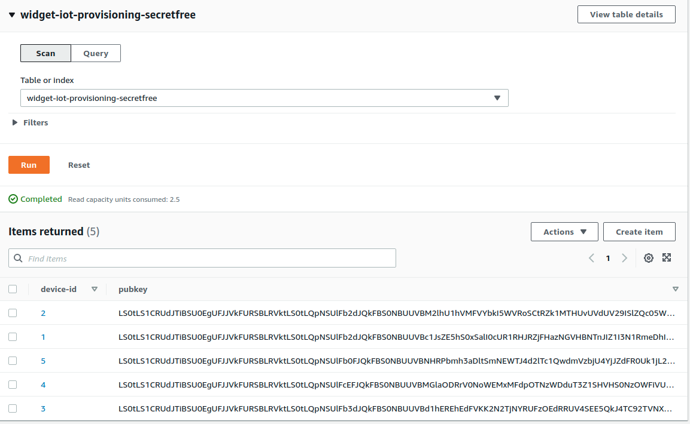

# Verify cloud operations

The easiest way to verify the cloud operations is by using the Postman
tool.

Steps to verify:

1. Load test data to Amazon DynamoDB.

## Test Data Load

Amazon DynamoDB is a NoSQL, cloud-native database that organizes data
by *keys*. In this system, the **key** is the **device-id** and the
**value** is the **device-pubkey**.

The **device-id** is a unique id that usually represents the unique id
assigned to the processor, secure element, secure enclave, or other
hardware security device.  For more information, see the system design.

The **device-pubkey** is the public key that is derived from the
device private key. Cryptographic algorithms guarantee that a public
key uniquely represents the private key.  For more information, see the
system design.

For the test data load, you create five "devices" with an incrementing
serial number from 1..5.  The local device artifacts (private key,
public key, and certificate signing request) are created in
`ROOT/verify/devices` and are named with the prefix **e2e_**.

The entries are then put to Amazon DynamoDB.

Invoke the `load-data.sh` script with SKUNAME.  For example, if your
SKUNAME is `widget`, run the script as:

```bash
cd script
./load-verify-data.sh widget
```

The artifacts will be in `devices/verify`.  To verify they are in
Amazon DynamoDB:

1. Log in to the AWS Console.
2. Navigate to the Amazon DynamoDB console by typing "dynamodb" in the
   search box and selecting **DynamoDB**.
3. In the left-hand panel, select **Items**.
4. In the main panel, select the database which will be
   SKUNAME-iot-provisioning-secretfree, or if your SKUNAME is widget,
   it will be `widget-iot-provisioning-secretfree`.  You should see
   five items similar to the following:




## Verifying the AWS API Gateway processing

The AWS API Gateway processing can be manually tested using
[Postman](https://www.getpostman.com/).  In this test, we will be
using the CSR generated in the previous section.

Test the payload to receive the response.

1.  Open Postman.
2.  If you haven't already created a collection for testing, create
    a collection. Name it Certificate Test and click **Create**.
3.  Create a new Request by selecting the ellipis on the Certificate
    Test header and select **Add request**.
4.  Change the request name **Happy Path**.
4.  Click the new request on the left hand side.
5.  On the right hand side, right under the 'Happy Path' title,
    there is a drop down for the type of request. Select **POST**.
6.  Next, implement the header for **device-csr**. Under the
    **Headers** tab, for a new key, enter **device-csr**.
7.  For the value, you will need to create a base64 representation of
    CSR.
    
    ```bash
    cd scripts
    base64 --wrap 0 ../devices/verify/e2e_1.csr
    ```
     use the emitted value.  This will be passed to API Gateway for inspection.

8. Funally, enter the request URL.  Get this from your deployed API in the stage Live.
   1.  In the AWS API Gateway console, click WidgIoTProvisioning > Stages.
   2.  At the top of the page, you will see the Invoke URL.  Copy the URL.
   3.  Paste the URL in postman request URL input.  Append '/proto'.

To invoke the URL, click the Send button.  You should receive a
certificate in the Body response that is plain text format and looks
like the following.  This certificate you can use to run the demo
programs that come with AWS Device SDKs.

```text
-----BEGIN CERTIFICATE-----
MIIDmjCCAoKgAwIBAgIVALkKro9sVNMelt6pwtH153r8eddgMA0GCSqGSIb3DQEB
CwUAME0xSzBJBgNVBAsMQkFtYXpvbiBXZWIgU2VydmljZXMgTz1BbWF6b24uY29t
IEluYy4gTD1TZWF0dGxlIFNUPVdhc2hpbmd0b24gQz1VUzAeFw0yMTEwMjIxODU4
NThaFw00OTEyMzEyMzU5NTlaMF4xCzAJBgNVBAYTAlVTMQswCQYDVQQIDAJWQTER
MA8GA1UEBwwIQW55d2hlcmUxEjAQBgNVBAoMCUF1dG9tYXRyYTEPMA0GA1UECwwG
d2lkZ2V0MQowCAYDVQQDDAExMIIBIjANBgkqhkiG9w0BAQEFAAOCAQ8AMIIBCgKC
AQEA0+9x56oYYknzybtwvtr+waQOyfAM1OZ6ryjZrWZVz7f0pWjJljLKzf/L/ins
MacBN //oxaF6G+b83BWcgmM2SN2nQtFFx2IuFwF19V5x35EmDI6QndW4fHbIfD8r
8lh1dA5Q8Xo3ySu34jpWPu/PTUAd22Tx36sHNqh/T/fvLZkjA3eZI5kvd+dkM8AH
jEG0NZjKc9w0Gv3BfEuE7x6tiCHF6o5tCxXebmfyPOE34YyNlESRrJ9tf/IPwFLx
Zvwm0ipqZ9sd9YXwhLMybjQT5IsfxYpv2rhO3QCzfXkmLv+cP2Xd0cxKz+71wTJV
BhejxRvSDJtUHvw55IFj8KxxRQIDAQABo2AwXjAfBgNVHSMEGDAWgBT75VhYdBt9
Tgl5BC8hK1wDrmFwTjAdBgNVHQ4EFgQUHcrF1WyXbyd+hKxzgFy93+GH4V8wDAYD
VR0TAQH/BAIwADAOBgNVHQ8BAf8EBAMCB4AwDQYJKoZIhvcNAQELBQADggEBABcB
ZFogtxqJagIzPQPFAk7oQf/QYi8RsIz6MuQgSIkBOvWIZdTjkWcOtS5u3MV5El+n
NpZMQfFWYgDbJFlbSjyPSPFQpTpqUE/mIZCJmH99PVKG79p5V0L078/YXOENkzGn
gLkAD6nv5BO+mPqu60kNeIe2ppf505VTM19DceVDAm1qU6gZ3kIu19wrX3nn65WI
NgCMHQhAJ0b4gc/Xam4r8Y/QnJpZyEuCDmVh4rEdSqY9JMWpH3iTX8wL0eHhHlR9
TS+o7wEibkZBhiYzohp3EAyxrbpTloyEq+DSOffaORbVb1eVZqY5Bih8GHDMTnW7
OMrUfpjFO1VtHE99uGM=
-----END CERTIFICATE-----
```


